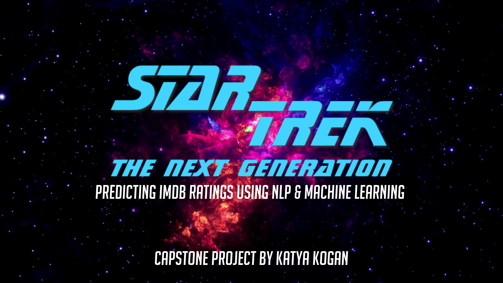

# Capstone Project - TrekPredict: Predicting IMDB Ratings Using NLP & Machine Learning

 

What if you could predict the ratings from the script of any show? I explored and tested this upon one of my most favourite tv shows in existence, Star Trek: The Next Generation. 

The project contains (in viewing order): 

## Summary
1. KatyaKogan_Capstone_Report.pdf (final report) 
2. KatyaKogan_Final_Presentation.pdf (final presentation for tech audience) 
3. KatyaKogan_Demo_Day.pdf (presentation file for demo day)

## Notebooks
1. Part1_TrekPredict_CleaningEDA.ipynb
2. Part2_TrekPredict_Modelling.ipynb 

## Data
1. model_comp.csv (comparing models)
2. PCT_graph.csv (modelling dataset)
3. TNG.csv.gz (original dataset) 
4. total_word_count.csv 

Required libraries: 
- pandas
- numpy
- seaborn
- matplotlib
- sklearn 

Extras: 
- shap (https://shap.readthedocs.io/en/latest/index.html)
- mord (https://pythonhosted.org/mord/)
- time 

 

